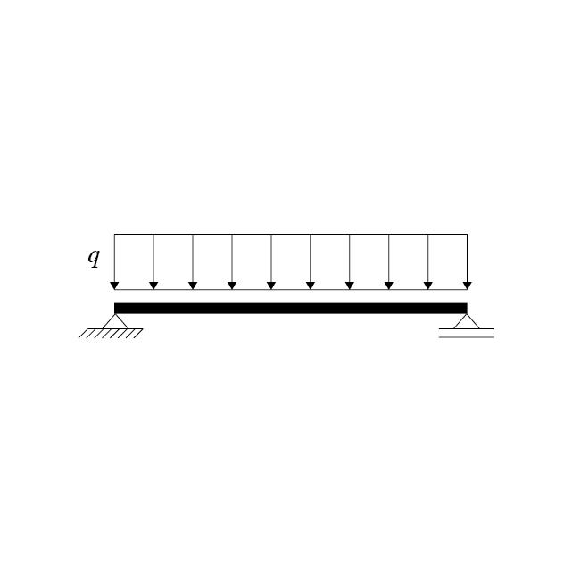

# Análise de Viga Isostática com Carga Distribuída

## Descrição
Este documento descreve uma viga isostática com carga distribuída, apoiada em um apoio fixo à esquerda e um apoio móvel à direita.

## Equações Relacionadas

### Linha Elástica (Deformabilidade)

A linha elástica da viga é dada pela equação da curvatura sob a ação de uma carga distribuída \( w \):

$$
EI \frac{d^4 y}{dx^4} = w 
$$
onde \( EI \) é o produto da rigidez à flexão pela inércia da área da seção transversal, \( y \) é a deflexão da viga, e \( w \) é a carga por unidade de comprimento.

### Esforço Cortante (V)

O esforço cortante ao longo da viga varia linearmente devido à carga distribuída e é dado por:

$$
V(x) = V_0 - w \cdot x 
$$

onde \( V_0 \) é o esforço cortante no apoio fixo, \( w \) é a carga distribuída e \( x \) é a posição ao longo da viga.

### Momento Fletor (M)

O momento fletor em qualquer seção da viga pode ser calculado integrando a equação do esforço cortante:

$$
M(x) = M_0 + V_0 \cdot x - \frac{w \cdot x^2}{2}
$$

onde \( M_0 \) é o momento fletor no apoio fixo, assumido como zero em caso de apoio simples.

### Esforços Máximos e Mínimos

Os esforços máximos e mínimos ocorrem nos apoios e no centro da viga, dependendo das condições de contorno e da distribuição de carga.

## Conclusões

Esta análise permite determinar as reações nos apoios, bem como a distribuição dos esforços internos na viga, essenciais para o dimensionamento estrutural seguro e eficiente.

---

Generated by Eng. Antonio Leitao Filho
